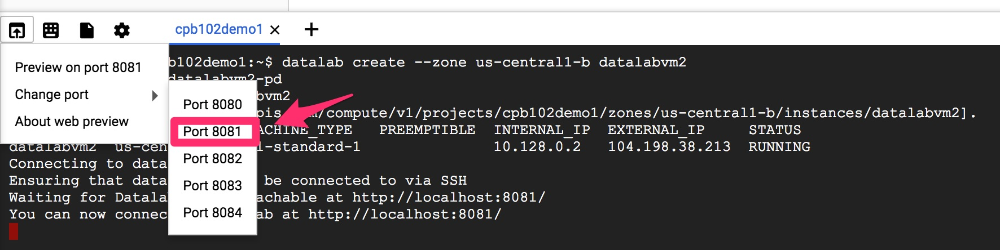

# Lab1a: Datalab の起動

## Datalab の起動手順

まずは Cloud Shell から Datalab を起動します。

### Datalab 用のインスタンス作成

```
datalab create --zone us-central1-b datalabvm
```

以下のように接続可能というメッセージが出力されるまで待ちます。

```
shuhei_fujiwara@cpb102demo1:~$ datalab create --zone us-central1-b datalabvm
Creating the instance datalabvm
Created [https://www.googleapis.com/compute/v1/projects/cpb102demo1/zones/us-central1-b/instances/datalabvm].
Connecting to datalabvm.
This will create an SSH tunnel and may prompt you to create an rsa key pair.
Waiting for Datalab to be reachable at http://localhost:8081/

The connection to Datalab is now open and will remain until this command is killed.
Click on the *Web Preview* (up-arrow button at top-left), select *port 8081*, and start using Datalab.
```

### Datalab の起動



### 公式リポジトリのダウンロード

新規ノートブックを作成して、ノートブック上で以下のコマンドを実行します。

```sh
%bash
git clone https://github.com/topgate/training-gcp
```

`training-gcp/CPB102` 以下に lab で使用するノートブックが入っています。

### 接続が切れたり Cloud Shell を再起動した場合

以下のコマンドで Datalab 用に作成したインスタンスに再接続できます。

```
datalab connect datalabvm
```
