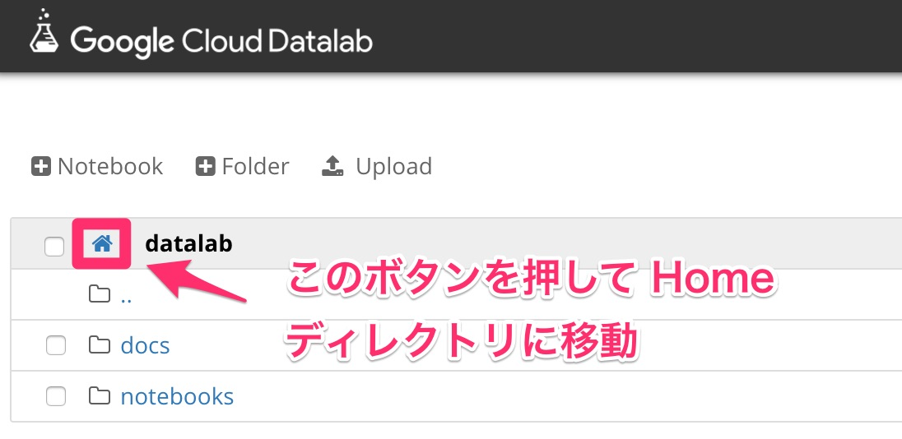

# Lab1a: Datalab の起動

## Datalab の起動手順

まずは Cloud Shell から Datalab を起動します。

### Datalab コマンドラインツールのインストール

```
sudo gcloud components install datalab
```

### Datalab 用のインスタンス作成

```
datalab create --zone us-central1-b datalabvm
```

以下のように `You can now connect to Datalab at http://localhost:8081/` というメッセージが出力されるまで待ちます。

```
shuhei_fujiwara@cpb102demo1:~$ datalab create --zone us-central1-b datalabvm
Creating the disk datalabvm-pd
Creating the instance datalabvm
Created [https://www.googleapis.com/compute/v1/projects/cpb102demo1/zones/us-central1-b/instances/datalabvm].
NAME        ZONE           MACHINE_TYPE   PREEMPTIBLE  INTERNAL_IP  EXTERNAL_IP     STATUS
datalabvm  us-central1-b  n1-standard-1               10.128.0.2   104.198.38.213  RUNNING
Connecting to datalabvm
Ensuring that datalabvm can be connected to via SSH
Waiting for Datalab to be reachable at http://localhost:8081/
You can now connect to Datalab at http://localhost:8081/
```

### Datalab の起動


### 公式リポジトリのダウンロード

まずは Datalab 上で home ディレクトリに移動します。



次に新規ノートブックを作成して、ノートブック上で以下のコマンドを実行します。

```sh
%bash
git clone https://github.com/GoogleCloudPlatform/training-data-analyst.git
```

`training-data-analyst/CPB102` 以下に lab で使用するノートブックが入っています。
