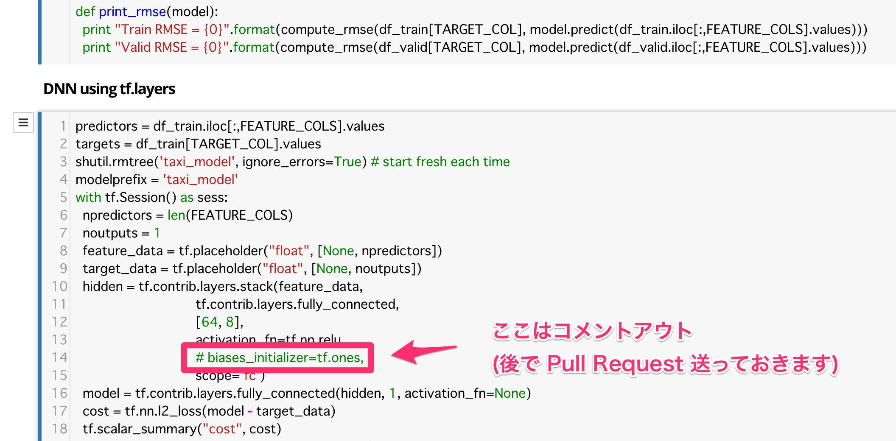

公式の lib2c の [tflayers.ipynb](https://github.com/GoogleCloudPlatform/training-data-analyst/blob/master/CPB102/lab2c/tflayers.ipynb) と [monitoring.ipynb](https://github.com/GoogleCloudPlatform/training-data-analyst/blob/master/CPB102/lab2c/monitoring.ipynb) に従って作業をします。

2017-02-23 現在 `tflayers.ipynb` は不具合で動かない部分があるので気を付けてください。
次のように修正をすれば動かすことができます。

