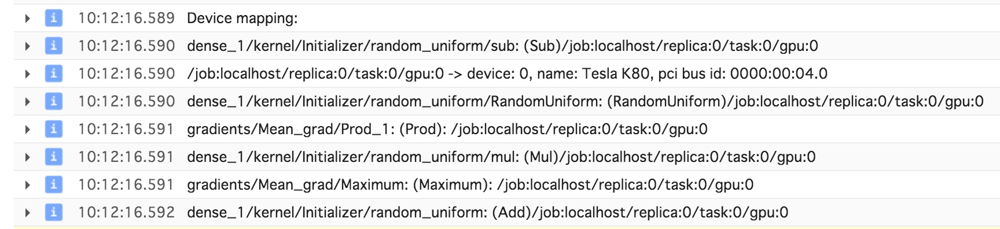

# Lab: Training on Cloud ML Engine

以下の作業は Cloud Shell 上で行うことを想定しています。
gcloud SDK がインストールされていればローカル環境で作業をすることも可能です。

## ジョブ実行までの最短手順

### サンプルコードのダウンロード

```sh
git clone https://github.com/topgate/training-gcp.git
cd training-gcp/CPB102/mlengine/train
```

以下のようなディレクトリ構成になっています。

```
├── config.yaml      # ML Engine の設定ファイル
└── trainer
    ├── __init__.py  # 中身は空で良い
    └── task.py      # ML Engine で実行して欲しいスクリプト
```

### シェル変数の準備

後々使い回すために、プロジェクト ID と作業用のバケット名をシェル変数に入れておきましょう。

```sh
PROJECT_ID=`gcloud config list project --format "value(core.project)"`
```

### Cloud Storage のバケット作成

学習済みのモデルなどを保存するために Cloud Storage のバケットを用意しておきます。

```sh
gsutil mb -c regional -l us-central1 gs://${PROJECT_ID}-ml
```

### Cloud ML Engine 上での学習

Job 名はプロジェクト内で一意でなければならないので、日付や時間の情報を入れて作成するのがおすすめです。

```sh
JOB_NAME="mnist`date '+%Y%m%d%H%M%S'`"

gcloud ml-engine jobs submit training ${JOB_NAME} \
  --package-path=trainer \
  --module-name=trainer.task \
  --staging-bucket="gs://${PROJECT_ID}-ml" \
  --region=us-central1 \
  --config=config.yaml \
  -- \
  --job-dir=gs://${PROJECT_ID}-ml/mnist/${JOB_NAME}
```

## 学習の様子

コンソール画面からジョブ一覧やログを見ることができます。
ログを見ると、計算に GPU が使われていることを確認できるはずです。
TensorFlow では使用するデバイスを指定しなかった場合、優先的に GPU を使用してくれる仕組みになっています。




## 付録

### ローカル環境で実行

TensorFlow や gcloud SDK が手元の環境に整っている場合、ローカル環境で実行することも可能です。

単純に Python のスクリプトを動かす場合は以下のコマンドで実行することができます。

```
python -m trainer.task --job-dir=mnist_local
```

Cloud ML Engine とほぼ同じ環境で動かしたい場合は `gcloud ml-engine train local` コマンドが用意されています。

```sh
gcloud ml-engine local train --module-name trainer.task \
                             --package-path trainer \
                             --job-dir gs://${PROJECT_ID}-ml/local
```

クラスタ上で分散処理を想定してコードを書いている場合でも、擬似的にクラスタが存在しているという体で動作してくれます。
また、環境変数 (Cloud ML Engine では環境変数にクラスタの情報などが入っています) も Cloud ML Engine と同じものを再現してくれます。
